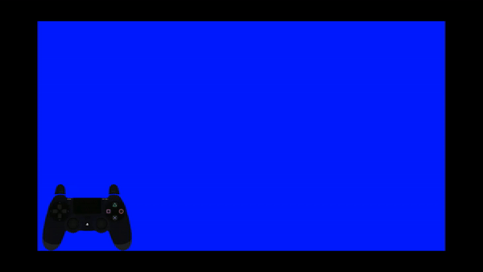

# Gamepad Overlay
The repository creates a dualshock controller overlay based on the QT framework. This program grabs dualshock input from bluetooth using the JSL library [link](https://github.com/JibbSmart/JoyShockLibrary/blob/master/JoyShockLibrary/JoyShockLibrary.cpp). SVG assets are taken from [link](https://gamepadviewer.com/).

The overlay only works for windowed or windowed borderless applications.

The overlay supports touch input up to two distinct touch events on the dualshock.
